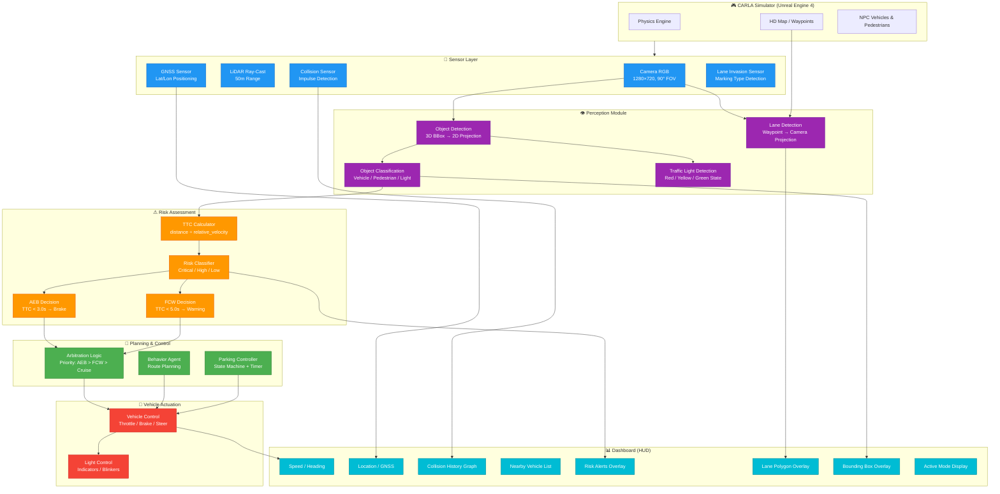

# ADAS System Architecture Diagram

## High-Level System Architecture

---

## Data Flow Summary

| Stage | Input | Processing | Output |
|-------|-------|-----------|--------|
| **Sensing** | CARLA world state | Sensor data acquisition | Raw camera, LiDAR, GNSS, collision, lane events |
| **Perception** | Camera images + Map waypoints | World-to-camera projection, BBox computation | 2D lane boundaries, 2D object bounding boxes, classifications |
| **Risk Assessment** | Object distances + velocities | TTC computation + threshold comparison | Risk level (Critical/High/Low), AEB/FCW decisions |
| **Planning** | Risk decisions + Navigation goal | Behavior agent + arbitration + parking FSM | Desired vehicle control commands |
| **Actuation** | Control commands | Apply throttle/brake/steer | Vehicle motion + indicator lights |
| **Visualization** | All module outputs | HUD rendering via pygame | On-screen dashboard with overlays |

---

## Module-to-Code Mapping

| Architecture Module | Code Class / Function | Lines |
|--------------------|----------------------|-------|
| Sensor Layer | `CollisionSensor`, `LaneInvasionSensor`, `GnssSensor`, `CameraManager` | 575–731 |
| Lane Detection | `World._render_adas()` — lane polygon section | 222–254 |
| Object Detection | `World._render_adas()` — bounding box section | 256–329 |
| TTC / Risk Assessment | `World._render_adas()` — TTC extrapolation | 275–343 |
| Behavior Agent | `BehaviorAgent` (CARLA PythonAPI) | 814 |
| Parking Controller | `game_loop()` — parking logic | 833–857 |
| Vehicle Actuation | `game_loop()` — control application | 864–871 |
| HUD Dashboard | `HUD` class | 401–535 |
| Traffic Spawning | `spawn_traffic()` | 732–786 |
