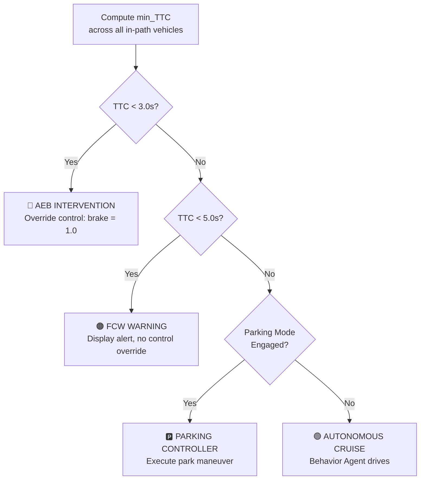
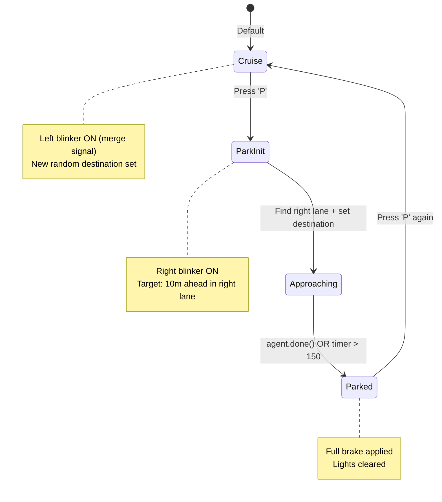

# Feature Logic Explanation

## Table of Contents
1. [Time-to-Collision (TTC) Calculation](#1-time-to-collision-ttc-calculation)
2. [Threshold Values & Risk Levels](#2-threshold-values--risk-levels)
3. [Arbitration Logic](#3-arbitration-logic---handling-multiple-alertsactions)
4. [Lane Detection & Visualization](#4-lane-detection--visualization)
5. [3D Object Detection & Bounding Boxes](#5-3d-object-detection--bounding-boxes)
6. [Autonomous Parking Logic](#6-autonomous-parking-logic)
7. [Traffic Light Detection](#7-traffic-light-detection)

---

## 1. Time-to-Collision (TTC) Calculation

### Formula

```
TTC = D_longitudinal / V_relative
```

Where:
- **D_longitudinal** = Forward distance from ego vehicle to target vehicle (in ego vehicle's local coordinate frame, measured along the X-axis)
- **V_relative** = Speed of ego vehicle − Speed of target vehicle (closing speed)

### Implementation Details

The system transforms each detected vehicle's position into the **ego vehicle's local coordinate frame** using the inverse transformation matrix:

```python
# Transform target position to ego vehicle's local frame
v_inv_mat = np.array(self.player.get_transform().get_inverse_matrix())
p = np.dot(v_inv_mat, [a_loc.x, a_loc.y, a_loc.z, 1.0])
# p[0] = longitudinal distance (forward)
# p[1] = lateral offset (left/right)
```

### Conditions for TTC Computation

| Condition | Value | Rationale |
|-----------|-------|-----------|
| **Lateral offset** | `abs(p[1]) < 2.0 m` | Only consider vehicles in the same lane (± 2m) |
| **Actor type** | `"vehicle" in actor.type_id` | TTC is only computed for vehicles, not pedestrians/lights |
| **Forward only** | `p[0] > 0` | Ignore vehicles behind the ego car |
| **Positive closing speed** | `rel_v > 0.1 m/s` | Only if we're actually approaching the target |
| **Detection range** | `dist < 80.0 m` | Ignore objects beyond 80m for performance |

### Multi-Object TTC Selection

When multiple vehicles satisfy the conditions, the system selects the **minimum TTC** across all candidates:

```python
min_ttc = 999.0  # Initialize to a safe default
for each vehicle in detected_vehicles:
    if conditions_met:
        ttc = p[0] / rel_v
        if ttc < min_ttc:
            min_ttc = ttc
```

This ensures the **most imminent threat** drives the alert system.

---

## 2. Threshold Values & Risk Levels

### Risk Classification Table

| TTC Range | Risk Level | Action | Alert Color | System Response |
|-----------|------------|--------|-------------|-----------------|
| **TTC < 3.0 s** | 🔴 CRITICAL | **AEB Intervention** | Red `(255, 0, 0)` | Automatic Emergency Braking activates |
| **3.0 s ≤ TTC < 5.0 s** | 🟠 HIGH | **FCW Active** | Orange `(255, 165, 0)` | Forward Collision Warning displayed |
| **TTC ≥ 5.0 s** | 🟢 LOW | **Monitoring** | Green `(0, 255, 0)` | Continue normal operation |
| **No threat** | ⚪ NONE | **Cruise** | N/A | No TTC overlay displayed |

### Threshold Justification

- **3.0 seconds** (AEB): Industry standard for automatic braking intervention. At 60 km/h, this corresponds to ~50m — sufficient for emergency deceleration.
- **5.0 seconds** (FCW): Provides auditory/visual warning with enough time for human reaction (~1.5s) plus braking.
- **0.1 m/s** (minimum relative velocity): Filters out noise when both vehicles travel at nearly identical speeds.
- **2.0 m** (lateral threshold): Approximately one lane width, ensuring only in-path vehicles trigger alerts.

### Object Distance Color Coding (Bounding Boxes)

| Distance | Box Color | Meaning |
|----------|-----------|---------|
| **< 10 m** | Red `(255, 0, 0)` | Immediate danger zone |
| **10–20 m** | Yellow `(255, 255, 0)` | Caution zone |
| **> 20 m** | Green `(0, 255, 0)` | Safe tracking |

---

## 3. Arbitration Logic — Handling Multiple Alerts/Actions

### Priority Hierarchy

The system uses a **priority-based arbitration** scheme to resolve conflicts when multiple ADAS features generate simultaneous commands:

```
Priority 1 (Highest): AEB — Automatic Emergency Braking
Priority 2:           FCW — Forward Collision Warning
Priority 3:           Parking Controller
Priority 4 (Lowest):  Autonomous Cruise (Behavior Agent)
```

### Arbitration Flow



### Implementation

```python
# 1. TTC is computed and displayed in _render_adas()
if min_ttc < 3.0:
    risk = "CRITICAL RISK - AEB INTERVENTION"  # Top priority
elif min_ttc < 5.0:
    risk = "HIGH RISK - FCW ACTIVE"            # Second priority

# 2. In game_loop(), parking vs cruise arbitration:
if world.is_parking:
    # Parking controller logic (Priority 3)
    control = agent.run_step()
    if agent.done() or park_timer > 150:
        control.throttle = 0.0
        control.brake = 1.0   # Full stop
else:
    # Normal cruise (Priority 4)
    control = agent.run_step()
```

### Key Arbitration Rules

1. **Minimum TTC wins**: When multiple vehicles are in-path, the lowest TTC determines the alert level
2. **AEB overrides all**: A critical risk automatically triggers braking regardless of parking or cruise state
3. **Single-alert display**: Only the highest-priority alert is shown on the HUD to avoid driver confusion
4. **Parking completion rule**: Parking mode auto-completes after 150 ticks (~7.5 seconds) with full braking

---

## 4. Lane Detection & Visualization

### Camera Projection Model

The system uses a **pinhole camera model** to project 3D world-space lane boundaries onto the 2D display:

#### Camera Intrinsic Matrix (K)

```
K = | f_x   0   c_x |
    |  0   f_y  c_y |
    |  0    0    1  |
```

Where:
- `f_x = f_y = width / (2 × tan(FOV/2))` — focal length in pixels
- `c_x = width / 2` — principal point X (image center)
- `c_y = height / 2` — principal point Y (image center)
- `FOV = 90°` — camera field of view

For 1280×720 resolution: `f_x = f_y = 640`, `c_x = 640`, `c_y = 360`.

### Lane Boundary Computation

1. **Query current waypoint** from the HD map at the ego vehicle's location
2. **Iterate forward** 15 waypoints, each 2.0m apart (total ~30m lookahead)
3. For each waypoint, compute **left and right lane boundaries**:
   ```
   left_boundary  = waypoint.location − right_vector × (lane_width / 2)
   right_boundary = waypoint.location + right_vector × (lane_width / 2)
   ```
4. **Project to camera coordinates** using the world-to-camera matrix (`w2c`)
5. **Project to image coordinates** using the intrinsic matrix (`K`)
6. **Render** a filled green polygon connecting left + reversed right points, plus boundary lines

### Depth Check

Only points with positive camera-space Z (`l_cam[2] > 0`) are rendered, ensuring we don't project points behind the camera.

---

## 5. 3D Object Detection & Bounding Boxes

### 8-Point Bounding Box Projection

Each detected actor's 3D bounding box (8 corners) is projected to 2D screen space:

1. **Compute 8 corner points** from the actor's bounding box extent `(±ex, ±ey, ±ez)`
2. **Transform to world space** using the actor's transformation matrix
3. **Transform to camera space** using the camera's inverse matrix (`w2c`)
4. **Project to image space** using the intrinsic matrix (`K`)
5. **Compute 2D bounding rectangle** from min/max of projected corners
6. **Render box + label** with distance information

### Classification Labels

| Actor Type | Label | Default Color |
|------------|-------|---------------|
| `vehicle.*` | `[Car]` | Green (distance-dependent) |
| `walker.pedestrian.*` | `[Ped]` | Orange `(255, 100, 0)` |
| `traffic.light` (Red) | `[LIGHT]` | Red `(255, 0, 0)` |
| `traffic.light` (Yellow) | `[LIGHT]` | Yellow `(255, 255, 0)` |

---

## 6. Autonomous Parking Logic

### State Machine



### Parking Steps

| Step | Action | Details |
|------|--------|---------|
| 1. **Detect** | Find right lane | Uses `get_right_lane()` from current waypoint |
| 2. **Signal** | Activate right blinker | `carla.VehicleLightState.RightBlinker` |
| 3. **Approach** | Navigate to parking spot | Behavior agent steers to a point 10m ahead in right lane |
| 4. **Stop** | Full brake when done | `throttle=0, brake=1, steer=0` after agent completes or 150 ticks |
| 5. **Exit** | Resume cruise | Left blinker → new random destination |

---

## 7. Traffic Light Detection

### Detection Logic

1. Filter all actors matching `*traffic.light*`
2. Query light state via `actor.get_state()`
3. **Only display Red and Yellow lights** (green lights are safe → skip)
4. Render bounding box in the corresponding color

| Light State | Action | Box Color |
|-------------|--------|-----------|
| 🔴 Red | Display warning | `(255, 0, 0)` |
| 🟡 Yellow | Display caution | `(255, 255, 0)` |
| 🟢 Green | Skip (no display) | — |
