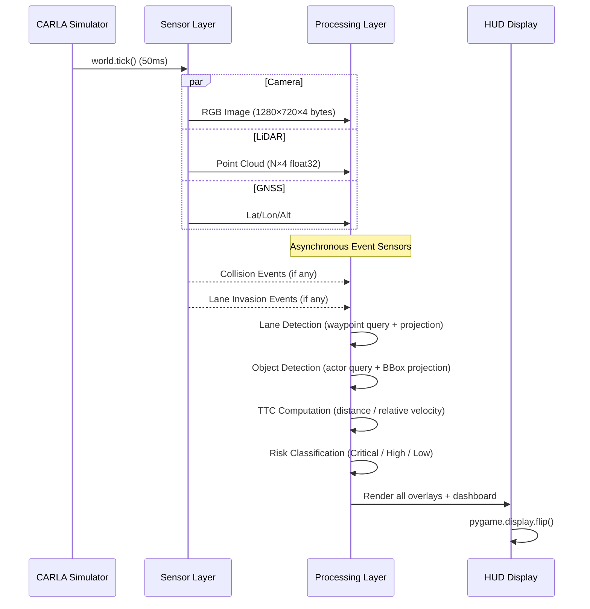

# 📡 Sensor Specifications

**ADAS Simulator — Detailed Sensor Configuration & Technical Specs**

---

## Table of Contents

1. [Sensor Overview](#1-sensor-overview)
2. [RGB Camera](#2-rgb-camera)
3. [LiDAR Sensor](#3-lidar-sensor)
4. [GNSS Sensor](#4-gnss-sensor)
5. [Collision Sensor](#5-collision-sensor)
6. [Lane Invasion Sensor](#6-lane-invasion-sensor)
7. [Sensor Mounting & Placement](#7-sensor-mounting--placement)
8. [Data Flow](#8-data-flow)

---

## 1. Sensor Overview

| Sensor | Type | Update Rate | Range | Primary Purpose |
|--------|------|-------------|-------|-----------------|
| **RGB Camera** | Passive vision | 20 Hz (sync) | Full scene | Perception, rendering, projection |
| **LiDAR** | Active ray-cast | 20 Hz (sync) | 50 m | 3D point cloud mapping |
| **GNSS** | Passive positioning | 1 Hz | Global | Geolocation tracking |
| **Collision** | Event-triggered | On collision | Contact | Accident detection & logging |
| **Lane Invasion** | Event-triggered | On invasion | Contact | Lane departure alerts |

---

## 2. RGB Camera

### Specifications

| Parameter | Value |
|-----------|-------|
| **Resolution** | 1280 × 720 pixels (720p HD) |
| **Field of View (FOV)** | 90° horizontal |
| **Color Depth** | 8-bit per channel (32-bit BGRA) |
| **Mounting** | SpringArm (3rd person) / Hood / Side / Top-Down |
| **Frame Rate** | Synchronized to simulation tick (20 FPS) |
| **Data Format** | Raw numpy array (H × W × 4, BGRA) |

### Camera Intrinsic Matrix

For the default configuration (1280×720, 90° FOV):

```
Focal length:  f = 1280 / (2 × tan(45°)) = 640 pixels
Principal point: (c_x, c_y) = (640, 360) pixels

K = | 640    0   640 |
    |   0  640   360 |
    |   0    0     1 |
```

### Projection Pipeline
```
3D World Point → World-to-Camera Transform (4×4) → Camera Space → Intrinsic K (3×3) → 2D Pixel
```

### Used By
- Lane Boundary Detection (waypoint projection)
- 3D Bounding Box Rendering (8-point projection)
- Traffic Light Detection (state-colored boxes)
- Traffic Sign Recognition (diamond markers)
- HUD rendering (pygame surface overlay)

---

## 3. LiDAR Sensor

### Specifications

| Parameter | Value |
|-----------|-------|
| **Type** | Ray-cast LiDAR |
| **Range** | 50 meters |
| **Channels** | 32 |
| **Points per Second** | 56,000 |
| **Rotation Frequency** | 10 Hz |
| **Upper FOV** | +10° |
| **Lower FOV** | -30° |
| **Mounting** | Roof-top center |

### Data Format
- **Raw output**: Array of `(x, y, z, intensity)` float32 values
- **Coordinate system**: Sensor-local, right-handed (X-forward, Y-right, Z-up)

### Visualization
- Point cloud rendered as colored dots on the HUD (distance-based coloring)
- Used for environmental awareness and sensor fusion reference

### Used By
- 3D environmental mapping visualization
- Sensor fusion demonstrations
- Point cloud overlay on camera feed

---

## 4. GNSS Sensor

### Specifications

| Parameter | Value |
|-----------|-------|
| **Type** | Global Navigation Satellite System (simulated) |
| **Update Rate** | 1 Hz |
| **Output** | Latitude (°), Longitude (°), Altitude (m) |
| **Noise Model** | None (perfect CARLA coordinates) |
| **Coordinate System** | WGS84 geographic coordinates |

### Data Format
```python
event.latitude   # float, degrees
event.longitude  # float, degrees
event.altitude   # float, meters
```

### Used By
- HUD location display (Lat/Lon readout)
- Vehicle position tracking

---

## 5. Collision Sensor

### Specifications

| Parameter | Value |
|-----------|-------|
| **Type** | Contact/impulse sensor |
| **Trigger** | On physical collision with any actor |
| **Output** | Actor ID, impulse vector, frame number |
| **Update Rate** | Event-driven (not periodic) |
| **Impulse Unit** | Newton-seconds (N·s) |

### Data Format
```python
event.other_actor    # carla.Actor — the other actor involved
event.normal_impulse # carla.Vector3D — impulse magnitude in 3D
event.frame          # int — simulation frame number
```

### Collision Intensity Formula
```
intensity = sqrt(impulse.x² + impulse.y² + impulse.z²)
```

### Used By
- HUD collision notification
- Collision history bar graph (last 5 seconds)
- Event logging for analysis

---

## 6. Lane Invasion Sensor

### Specifications

| Parameter | Value |
|-----------|-------|
| **Type** | Virtual lane marking sensor |
| **Trigger** | On crossing any lane marking |
| **Output** | Crossed marking types |
| **Update Rate** | Event-driven (not periodic) |

### Lane Marking Types Detected

| Marking Type | Description |
|-------------|-------------|
| `Solid` | Continuous line — no crossing allowed |
| `Broken` | Dashed line — lane change permitted |
| `SolidSolid` | Double solid — no crossing |
| `BrokenSolid` | Left broken, right solid |
| `SolidBroken` | Left solid, right broken |
| `BrokenBroken` | Double dashed |
| `BottsDots` | Raised reflective dots |
| `NONE` | No marking |

### Used By
- HUD lane departure notification
- Drive quality monitoring

---

## 7. Sensor Mounting & Placement

### Vehicle Sensor Layout

```
                   [GNSS]
                  [LiDAR]
        ┌──────────────────────┐
        │ ┌──────────────────┐ │
        │ │    Vehicle Roof   │ │
        │ │  (LiDAR + GNSS)  │ │
        │ └──────────────────┘ │
        │                      │
[Camera]│       Ego Vehicle    │
        │                      │
        │                      │
        │  [Collision Sensor]  │
        │  (attached to body)  │
        │                      │
        │ [Lane Invasion Sensor│
        │  (attached to body)] │
        └──────────────────────┘
```

### Camera Positions (TAB to cycle)

| Position | Transform Offset | Use Case |
|----------|-----------------|----------|
| 3rd Person | SpringArm behind/above | Default view, shows vehicle + surroundings |
| Hood Mount | Front bumper, forward-facing | Driver's perspective, ADAS overlay best view |
| Side View | Lateral offset | Side monitoring |
| Top Down | Elevated directly above | Bird's eye, traffic overview |

---

## 8. Data Flow

### Per-Frame Sensor Data Pipeline



### Data Sizes Per Frame

| Sensor | Data Size | Format |
|--------|-----------|--------|
| Camera RGB | ~3.7 MB | 1280 × 720 × 4 bytes (BGRA) |
| LiDAR | ~224 KB | ~56,000 points × 4 floats × 4 bytes/float |
| GNSS | 24 bytes | 3 × float64 |
| Collision | ~64 bytes | Event struct (on collision only) |
| Lane Invasion | ~32 bytes | Event struct (on invasion only) |

---

*Last Updated: March 2026*
